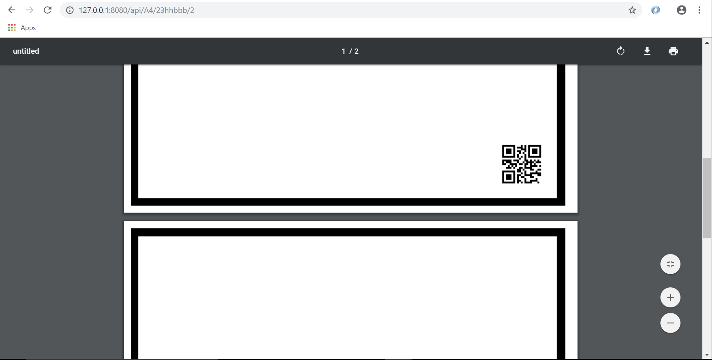

# OpenNoteScanner PDF Creator:

This repository contains some scripts that will let you create a final `.pdf` file to use with the Android Application OpenNoteScanner it is based on Python

---
<!-- TOC depthFrom:1 depthTo:6 withLinks:1 updateOnSave:1 orderedList:0 -->

- [OpenNoteScanner PDF Creator:](#opennotescanner-pdf-creator)
	- [Quick explanation of the code:](#quick-explanation-of-the-code)
	- [How to run the code through CLI in Linux:](#how-to-run-the-code-through-cli-in-linux)
	- [How to run the code for the server in Linux:](#how-to-run-the-code-for-the-server-in-linux)
	- [Final PDF example](#final-pdf-example)
	- [Android Application](#android-application)
	- [Some useful links:](#some-useful-links)
	- [Modules Documentation:](#modules-documentation)

<!-- /TOC -->

---
## Quick explanation of the code:

With a given name for the images and for the final PDF, the code will iterate based on a maximum amount of pages, it will create the QR images on a 512x512 Pixels, once the QR codes are generated the background images are created.

These Background images are created based on generating one main background (white) the middle image (black) and the top image (white). Those images are pasted together to have a page/image with a "Black Border" with a A4 size based on 300dpi.

Once all this is done will iterate again on each QR code creating each page of the `.pdf` pasting the codes on the right bottom site of the page.

Finally, we do a iteration on the images so we can append the images into a variable to generate the PDF file.

## How to run the code through CLI in Linux:

  1. **Let's update our system:**

     ```
     sudo apt-get update
     sudo apt-get upgrade
     ```

  2. **Let's install the modules needed:**

      We actually need some modules but some of them depend on other modules so for this I have upload a file called **`requirement.txt`** which has all packages installed on my computer but you don't need all this modules on you computer, so you have two options to install the packages.

       * Option 1:
       ```
       sudo pip install Pillow
       sudo pip install reportlab
       sudo pip install qrcode
       ```
       * Option 2:
       ```
       sudo pip install -r requirement.txt
       ```

  3. **Let's test the code and the modules**

      let's go to the **`Test`** directory and let's execute one of the files.
      Execute this on the terminal: **`python Multiple_QRcodes.py`** or **`python Single_QRcode.py`**

  4. **We are ready to run the script and get the PDF file**

      Run the code by typing on the terminal the following command: **`python generate_single_pdf.py`** or **`sudo python generate_single_pdf.py`**
      This will generate the **`.pdf`** file on the **`PDF`** directory and the final images used on the  `.pdf` file in the **`QR`** directory.

## How to run the code for the server in Linux:

  1. **Follow steps for CLI operations first to that code is working properly**

  2. **So now let's just run the server**

      Run the server by the following command: **`python run_server.py`** or **`sudo python run_server.py`**

      Now we can open up a browser tab or window and go to the `127.0.0.1:800/api/<page_size>/<qr_data>/<int_pages>` where:
        * **page_size** = Should be either `A4` or `letter`

          If not the application will return the message **`Please check size.`**

        * **qr_data** = The data you want to have on the QR image

          You have to have a data length higher than 4 character because if you do not do it you'll get the error **`QR data length should be higher than 4.`**

        * **int_pages** = Integer with the numbers of the pages you want the `.pdf` file to have.
  3. **Print it!**

      If you followed the steps above you should have gotten the pdf file on the browser like this:

      <div style="text-align:center">
        
      </div>

      now you just have to print it.

  **Note:** If you want the server running on the background just and an ampersand (`&`) at the end of the command when you execute the server.


## Final PDF example
If you did it correctly you should get a `.pdf` file like this:

<div style="text-align:center">
  
  <p>In this <a href="./Doc/pdf/Final.pdf"><b>link</b></a> you can see the final .pdf file created.</p>
</div>


## Android Application

[Google Play link](https://play.google.com/store/apps/details?id=com.todobom.opennotescanner&utm_source=global_co&utm_medium=prtnr&utm_content=Mar2515&utm_campaign=PartBadge&pcampaignid=MKT-Other-global-all-co-prtnr-py-PartBadge-Mar2515-1)

[GitHub Repository](https://github.com/ctodobom/OpenNoteScanner)

## Some useful links:

[Reporlab Module](https://pypi.python.org/pypi/reportlab/2.7).

[QRcode Module](https://pypi.python.org/pypi/qrcode/2.7).

[Pillow Module](https://pypi.python.org/pypi/Pillow/2.7.0).

[@BlackrockDigital](https://github.com/BlackrockDigital/startbootstrap-scrolling-nav) BootStrap template.


## Modules Documentation:

[Pillow Documentation](http://pillow.readthedocs.io/en/3.0.x/installation.html).

[Reportlab Documentation](https://www.reportlab.com/docs/reportlab-userguide.pdf).

[QRcode Documentation](https://github.com/lincolnloop/python-qrcode).
